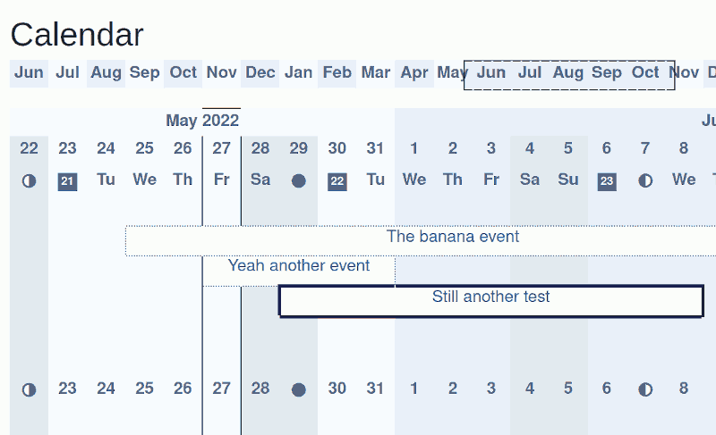
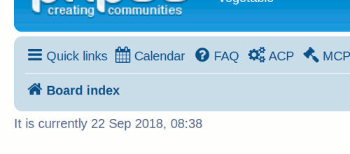
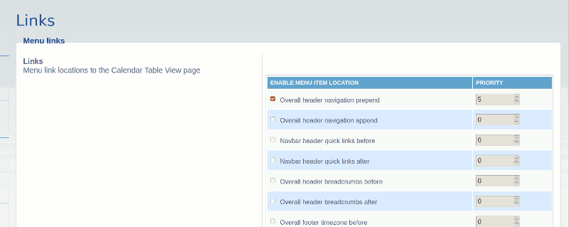
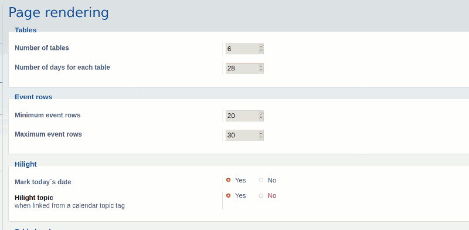
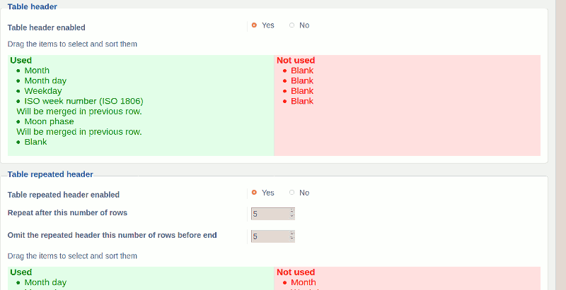

# phpBB Extension - marttiphpbb Calendar Table View

[Topic on phpbb.com](https://www.phpbb.com/community/viewtopic.php?f=456&t=2547991)

## Description

This phpBB extension provides a Calendar Table View page for the [Calendar extension set](https://github.com/marttiphpbb/phpbb-ext-calendarmono/blob/master/doc/calendar-set.md)

## Screenshot

## Requirements

* phpBB 3.3+
* PHP 7.1+
* phpBB extension [Menu Items](https://github.com/marttiphpbb/phpbb-ext-menuitems)
* phpBB extension [Calendar Tag](https://github.com/marttiphpbb/phpbb-ext-calendartag)
* phpBB extension [Calendar Mono](https://github.com/marttiphpbb/phpbb-ext-calendarmono)
* PHP calendar extension (PHP compiled with --enable-calendar)

When it's not possible for you to have PHP compiled with --enable-calendar see the [PHP Ext Calendar extension](https://github.com/marttiphpbb/phpbb-ext-phpextcalendar) for a possible solution.

## Quick Install

You can install this on the latest release of phpBB by following the steps below:

* Create `marttiphpbb/calendartableview` in the `ext` directory.
* Download and unpack the repository into `ext/marttiphpbb/calendartableview`
* Enable `Calendar Table View` in the ACP at `Customise -> Manage extensions`.

## Uninstall

* Disable `Calendar Table View` in the ACP at `Customise -> Extension Management -> Extensions`.
* To permanently uninstall, click `Delete Data`. Optionally delete the `/ext/marttiphpbb/calendartableview` directory.

## Support

* Report bugs and other issues to the [Issue Tracker](https://github.com/marttiphpbb/phpbb-ext-calendartableview/issues).

## License

[GPL-2.0](license.txt)

## More Screenshots

### Menu Link

### ACP: Links

### ACP: Page Rendering

